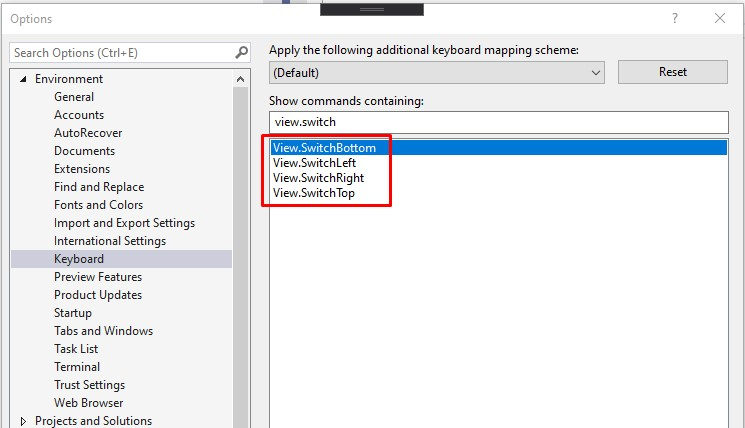

# Side Panel Switcher
Visual Studio extension to switch auto hide mode of left/right/bottom/top tool window groups by shortcut

----------------------------

To be able to switch side tool window panels just assign shortcuts to this commands:

## License
[Apache 2.0](LICENSE.txt)